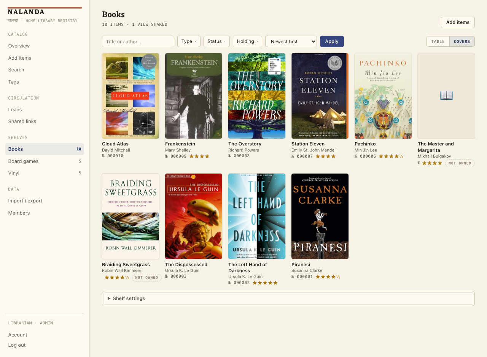
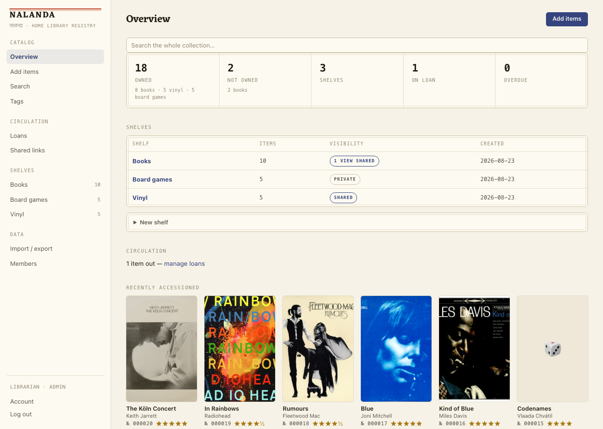
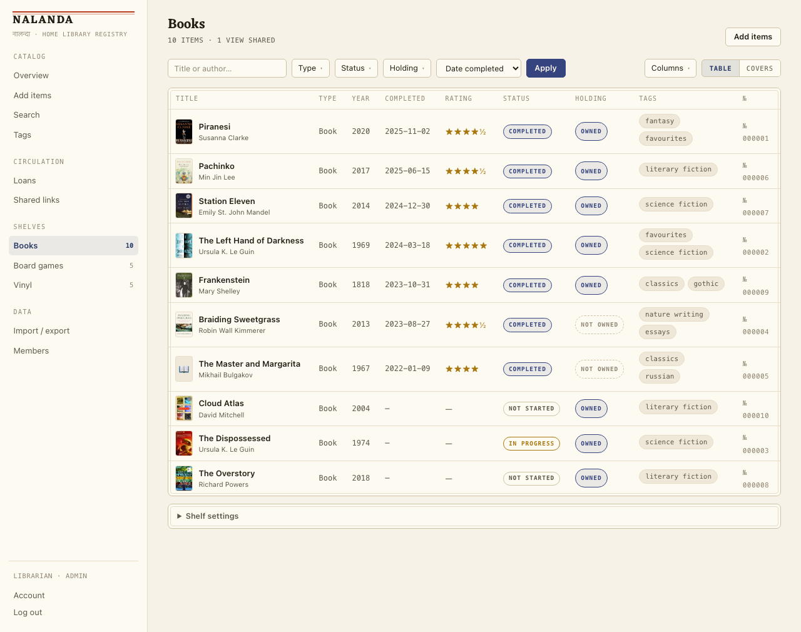
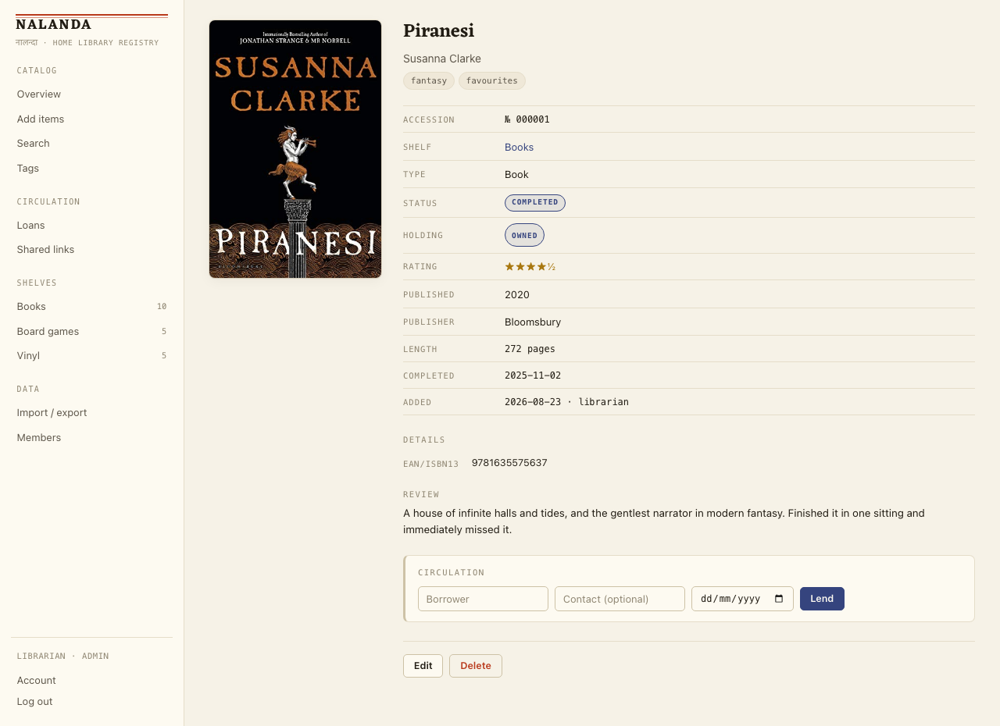
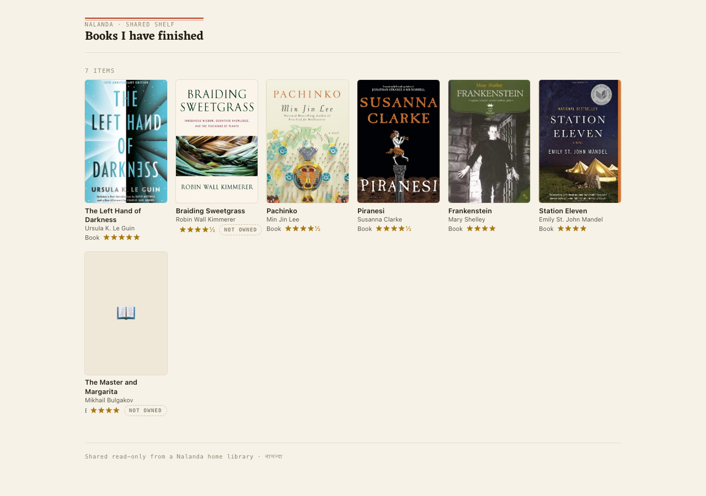
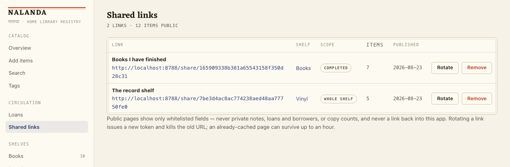
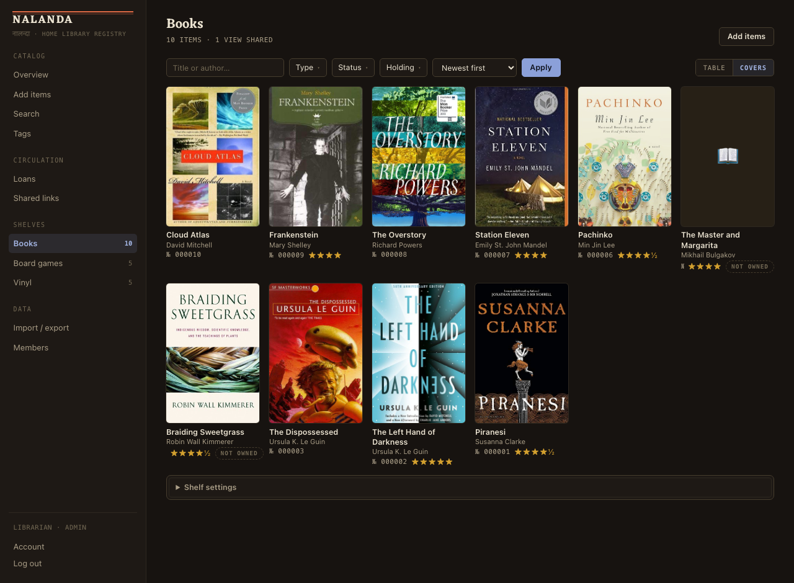

# Nalanda 📚

Self-hosted home library registry for **books, board games, and vinyl records** — and a
**Goodreads replacement** for the reading life around them — running on Cloudflare's free
tier at **$0/month**. Named for the library of the Nalanda mahāvihāra; styled after its
manuscripts.



- **Scan to shelf**: point your phone camera at a book or record barcode; ISBNs look up
  books (Open Library + Google Books), other barcodes look up vinyl (Discogs). Board games
  add by name search (BoardGameGeek).
- **Reading log, not just a catalog**: books you've read but don't own are first-class
  (`copies = 0`, badged "Not owned") — log a finished book by scanning it and writing the
  review, no shelf space required.
- **Goodreads import**: drop in a Goodreads export CSV — rows matching your shelves merge
  their ratings/reviews/read-dates onto existing books; the rest arrive as reading-log
  entries. Re-runs merge instead of duplicating. libib CSV import too.
- **Public share links, per view**: publish any filtered slice of a shelf ("my reviews",
  "owned sci-fi") at its own unguessable URL — rotate or remove each link independently.
  Private notes, loans, and copy counts never appear. Reviews can link out to blog posts.
  One admin page lists everything you've published, with the item count each link
  exposes.
- **Family accounts**: admin + members, no email infrastructure needed.
- **Loans**: track who borrowed what, with due dates and history.
- **Tags, half-star ratings, full-text search** across the collection, plus a quick
  title/author filter inside every shelf.
- **Own your data**: every field round-trips through CSV export; plain-SQLite backups.
- **The manuscript ledger**: a hand-written design system grounded in Nalanda's Pala-era
  scriptorium — palm-leaf paper, indigo and vermilion, Devanagari-first display type,
  a lamp-lit dark mode. No CSS framework.

Stack: TypeScript · Cloudflare Workers · Hono (server-rendered JSX) + htmx · D1 (SQLite) +
Drizzle · R2 for cover art. One deployable, no client build, three runtime dependencies.
See [ARCH.md](ARCH.md) for the design and the reasoning behind it.

## A look around

| | |
|---|---|
|  |  |
| **Overview** — what's owned, what's only read, what's out on loan, and how public each shelf is. | **The ledger view** — every shelf reads as a catalogue card, down to the accession number. |
|  |  |
| **An item** — metadata auto-filled from the barcode, your rating and review below it. | **A published share** — one filtered view, its own link. No notes, no loans, no way back into the app. |

Because publishing is the only way anything leaves the app, everything you've published
gets one page — each link's scope, the number of items it exposes right now, and rotate or
remove on the spot:



And a lamp-lit dark mode that follows the system setting:



Screenshots come from seeded demo data — `npm run dev:demo` and `npm run seed:demo` will
reproduce them on your own machine.

## Local development

```sh
npm install        # also vendors htmx, the ZXing barcode WASM, and fonts into public/vendor/
npm run db:migrate # create the local SQLite database
npm run dev        # http://localhost:8787 → /setup creates the admin account
npm test           # vitest, runs inside the real Workers runtime
```

Everything runs offline: local D1 is a real SQLite file, R2 is emulated, and the camera
works on localhost. Local secrets live in `.dev.vars` (copy `.dev.vars.example`).

## Running your own

Everything below fits inside Cloudflare's free tier. One-time setup:

```sh
wrangler d1 create nalanda            # note the id it prints
wrangler r2 bucket create nalanda-covers
wrangler secret put SESSION_SECRET
wrangler secret put DISCOGS_TOKEN     # free — enables vinyl barcode lookup
wrangler secret put HOME_SHARE_TOKEN  # optional — logged-out "/" redirects to this share

D1_DATABASE_ID=<the id> npm run deploy   # remote migrations, then wrangler deploy
```

This repo names no Cloudflare resource of its own: `database_id` in `wrangler.jsonc` is an
all-zero placeholder, and the deploy substitutes the real one from `D1_DATABASE_ID`. Local
development, local migrations, and the tests all run against the placeholder, so a fresh
clone works offline with nothing to edit. (`wrangler d1 list` will remind you of the id
later.)

From there `npm run deploy` is every update. If you'd rather not deploy from your laptop,
point Cloudflare's dashboard git integration at a branch with an empty build command and
`npm run deploy` as the deploy command, and set `D1_DATABASE_ID` as a build variable on
the Worker. Resource setup, custom domains, rollback, and data migration are covered step
by step in [runbooks/deploy.md](runbooks/deploy.md).

## Operations

| Runbook | When to use it |
|---|---|
| [deploy.md](runbooks/deploy.md) | First deploy, updates, rollback, custom domain, API tokens |
| [backup-and-restore.md](runbooks/backup-and-restore.md) | Routine backups, restoring after a mistake |
| [accounts-and-access.md](runbooks/accounts-and-access.md) | Family accounts, lost passwords, admin lockout, share links |
| [import-from-goodreads.md](runbooks/import-from-goodreads.md) | Bringing your Goodreads history over (and leaving) |
| [import-from-libib.md](runbooks/import-from-libib.md) | Migrating your libib collection |
| [troubleshooting.md](runbooks/troubleshooting.md) | Scanner, lookups, deploys, logs |

Working conventions for future development live in [CLAUDE.md](CLAUDE.md).
