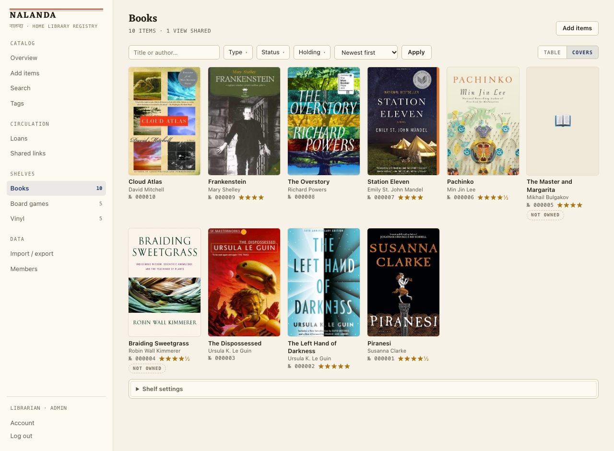
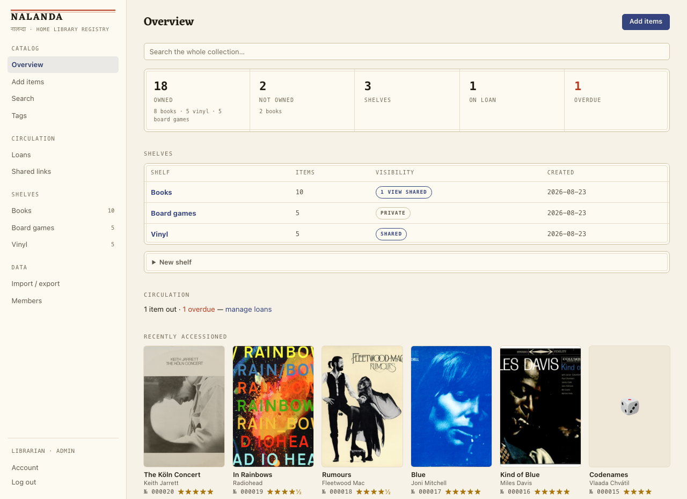
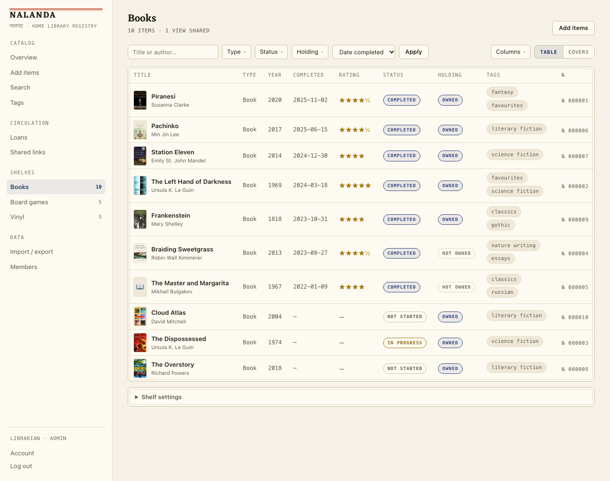
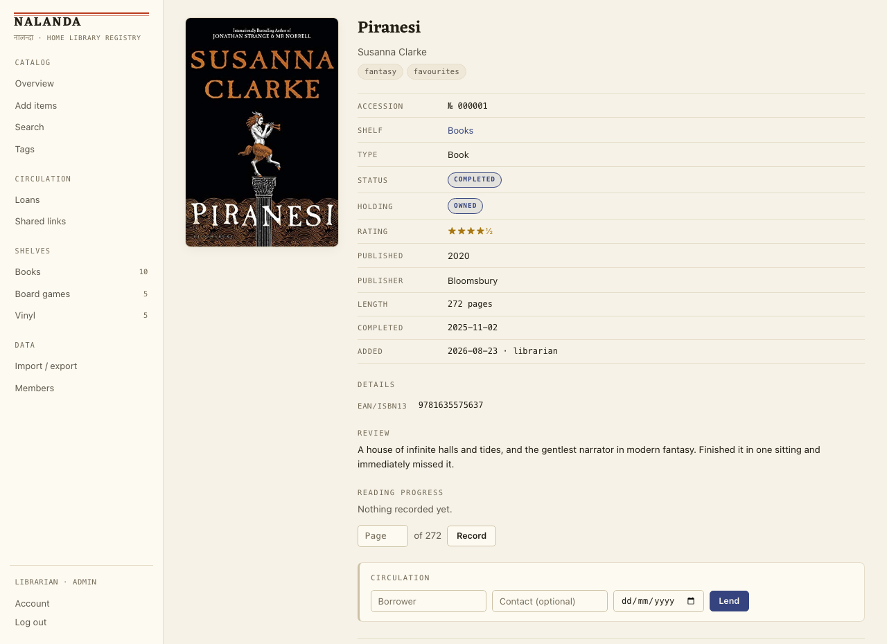
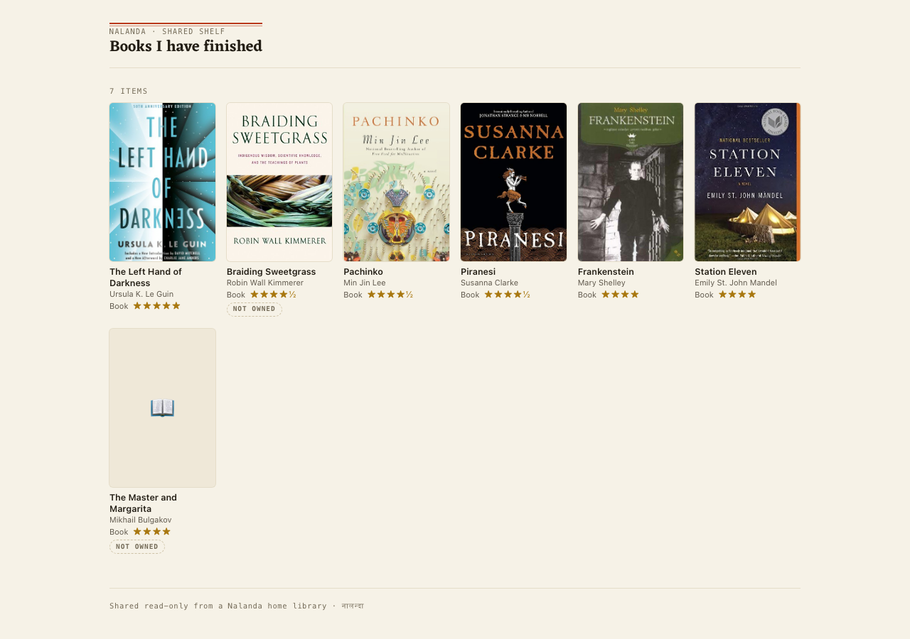
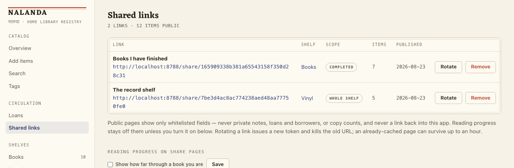
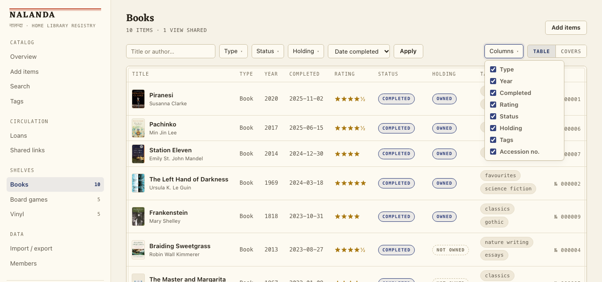
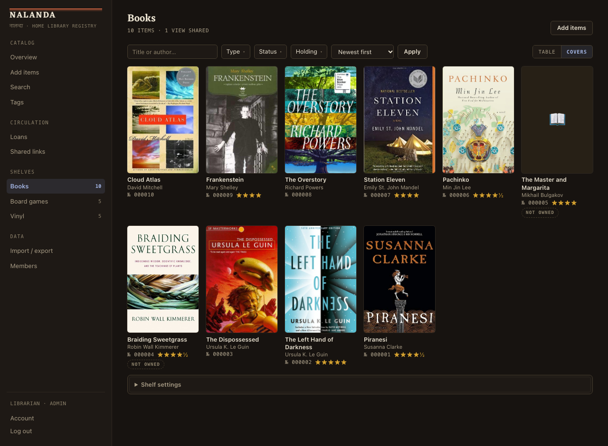

# Nalanda 📚

Self-hosted home library registry for **books, board games, and vinyl records** — and a
**Goodreads replacement** for the reading life around them — running on Cloudflare's free
tier at **$0/month**. Named for the library of the Nalanda mahāvihāra; styled after its
manuscripts.



## Features

One page per area in [docs/features/](docs/features/README.md), each accurate to the code on `main`:

- [Cataloguing](docs/features/cataloguing.md) — scan a barcode or search a name; Open Library, Google Books, BoardGameGeek and Discogs fill in the rest, covers included.
- [Reading](docs/features/reading.md) — every read is yours: pages, re-reads, ratings and reviews, quotes, goals, a year in review.
- [Shelves and search](docs/features/shelves-and-search.md) — filters, sorts and saved views, tags, bulk edit, search operators, creators and publishers.
- [Imports and exports](docs/features/imports-and-exports.md) — Goodreads, StoryGraph, LibraryThing and libib in; a CSV out that carries every field back.
- [Sharing](docs/features/sharing.md) — a public link per view, gift lists, feeds and QR codes; notes, loans and prices never appear.
- [Lending](docs/features/lending.md) — loans with due dates and history, and what you've borrowed from someone.
- [Connections](docs/features/connections.md) — two households that both run Nalanda follow, comment, borrow and recommend; pairwise, off by default.
- [Members and privacy](docs/features/members-and-privacy.md) — admins and members, display names, a read-only API, item history, a trash.
- [On your phone](docs/features/on-your-phone.md) — installs to the home screen and scans with no signal; nothing of yours is kept on the phone.

Stack: TypeScript · Cloudflare Workers · Hono (server-rendered JSX) + htmx · D1 (SQLite) +
Drizzle · R2 for cover art. One deployable, no client build, three runtime dependencies.
See [ARCH.md](ARCH.md) for the design and the reasoning behind it.

## A look around

| | |
|---|---|
|  |  |
| **Overview** — what's owned, what's only read, what's out on loan, and how public each shelf is. | **The ledger view** — every shelf reads as a catalogue card, down to the accession number. Sort by title, rating, date added or date finished. |
|  |  |
| **An item** — metadata auto-filled from the barcode, your rating and review below it. | **A published share** — one filtered view, its own link. No notes, no loans, no way back into the app. |

Because publishing is the only way anything leaves the app, everything you've published
gets one page — each link's scope, the number of items it exposes right now, and rotate or
remove on the spot:



Ten columns don't suit every shelf — a vinyl record has no "date finished", a board game
would rather show play time than year — so the table's columns are yours to pick, remembered
per device:



And a lamp-lit dark mode that follows the system setting:



The design system is hand-written — "the manuscript ledger", grounded in Nalanda's Pala-era
scriptorium: palm-leaf paper, indigo and vermilion, Devanagari-first display type, no CSS
framework (ARCH.md §16 #16). Screenshots come from seeded demo data — `npm run dev:demo` and
`npm run seed:demo` will reproduce them on your own machine.

A **read-only demo** of the same seeded data is published to GitHub Pages on each release — see
[runbooks/demo.md](runbooks/demo.md) for the address and how it is built; sign in with `demo` / `demo`.

## Local development

```sh
npm install        # also vendors htmx, the ZXing barcode WASM, and fonts into public/vendor/
npm run db:migrate # create the local SQLite database
npm run dev        # http://localhost:8787 → /setup creates the admin account
npm test           # vitest, runs inside the real Workers runtime
npm run lint       # accessibility rules over the views; npm run a11y audits every page in a browser
```

Everything runs offline: local D1 is a real SQLite file, R2 is emulated, and the camera
works on localhost. Local secrets live in `.dev.vars` (copy `.dev.vars.example`).

## Running your own

Everything below fits inside Cloudflare's free tier. One-time setup:

```sh
wrangler d1 create nalanda            # note the id it prints
wrangler r2 bucket create nalanda-covers
wrangler secret put SESSION_SECRET
wrangler secret put DISCOGS_TOKEN     # free — enables vinyl barcode lookup
wrangler secret put BGG_TOKEN         # free once BGG approves your app — board game search (runbooks/deploy.md → API tokens)
wrangler secret put HOME_SHARE_TOKEN  # optional — logged-out "/" redirects to this share
wrangler secret put FEDERATION_PRIVATE_KEY  # optional — turns on connections; see runbooks/connections.md

D1_DATABASE_ID=<the id> npm run deploy   # remote migrations, then wrangler deploy
```

The repo names no Cloudflare resource of its own: `database_id` in `wrangler.jsonc` is an
all-zero placeholder the deploy fills from `D1_DATABASE_ID`, so a fresh clone works offline with
nothing to edit. From there `npm run deploy` is every update; releases are numbered, and each one's
notes ([GitHub Releases](https://github.com/isstiaung/nalanda/releases), [CHANGELOG.md](CHANGELOG.md))
say what it changes and whether to back up first. Dashboard git integration, custom domains, rollback
and moving your data are in [runbooks/deploy.md](runbooks/deploy.md).

## On your phone

Add it to the home screen — Safari's **Share → Add to Home Screen** on iPhone and iPad,
Chrome's **Install app** on Android — and it opens full-screen, with a **Scan** shortcut. The
scanner keeps working with no signal, and no page of your catalog is ever stored on the phone:
[docs/features/on-your-phone.md](docs/features/on-your-phone.md), and
[runbooks/troubleshooting.md](runbooks/troubleshooting.md) when the camera won't open.

## Operations

| Runbook | When to use it |
|---|---|
| [deploy.md](runbooks/deploy.md) | First deploy, updates, rollback, custom domain, API tokens |
| [updating.md](runbooks/updating.md) | Moving an instance to a newer release |
| [backup-and-restore.md](runbooks/backup-and-restore.md) | Routine backups, restoring after a mistake |
| [accounts-and-access.md](runbooks/accounts-and-access.md) | Family accounts, lost passwords, admin lockout, share links |
| [connections.md](runbooks/connections.md) | Connecting with another household's Nalanda: keys, feed, comments, borrowing, disconnecting |
| [api.md](runbooks/api.md) | Reading your library as JSON with a token of your own |
| [import-from-goodreads.md](runbooks/import-from-goodreads.md) | Bringing your Goodreads history over (and leaving) |
| [import-from-storygraph.md](runbooks/import-from-storygraph.md) | Bringing your StoryGraph library over |
| [import-from-librarything.md](runbooks/import-from-librarything.md) | Bringing your LibraryThing catalog over |
| [demo.md](runbooks/demo.md) | The read-only demo on GitHub Pages: how it is built and published |
| [import-from-libib.md](runbooks/import-from-libib.md) | Migrating your libib collection |
| [import-from-kindle.md](runbooks/import-from-kindle.md) | Your Kindle highlights as quotes |
| [metadata-backfill.md](runbooks/metadata-backfill.md) | Filling in covers and descriptions for a large catalog, from your machine |
| [record-covers.md](runbooks/record-covers.md) | Replacing record covers stored from Discogs with the Cover Art Archive's (a one-off) |
| [troubleshooting.md](runbooks/troubleshooting.md) | Scanner, lookups, deploys, logs |

## Data sources

Metadata and covers come from Open Library, Google Books, BoardGameGeek, Discogs and, for
records' covers, MusicBrainz's Cover Art Archive, each under its own terms; if you run an
instance, you are the one using their APIs ([THIRD-PARTY.md](THIRD-PARTY.md)). Their terms ask
for credit beside their data, so a board game's page carries BoardGameGeek's "Powered by BGG"
logo, and a record whose pressing came from Discogs says "Data provided by Discogs.", linked to
that release on discogs.com. Discogs' images are never stored: its terms restrict them.

This application uses Discogs’ API but is not affiliated with, sponsored or endorsed by Discogs. ‘Discogs’ is a trademark of Zink Media, LLC.

Working conventions for future development live in [CLAUDE.md](CLAUDE.md); how to contribute, in
[CONTRIBUTING.md](CONTRIBUTING.md).
